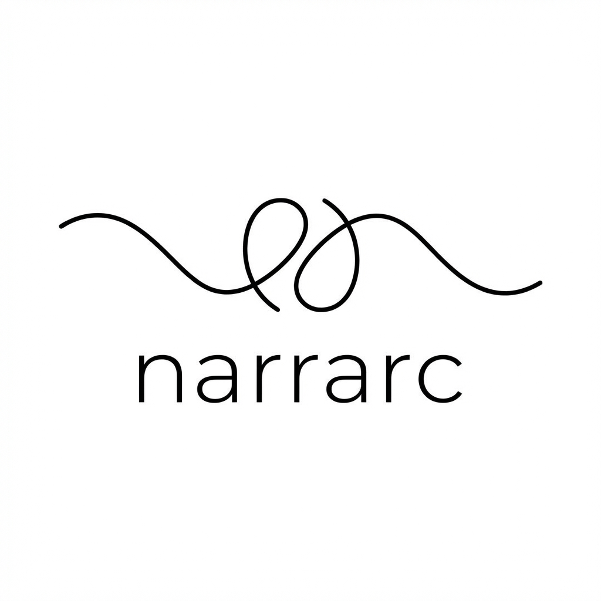
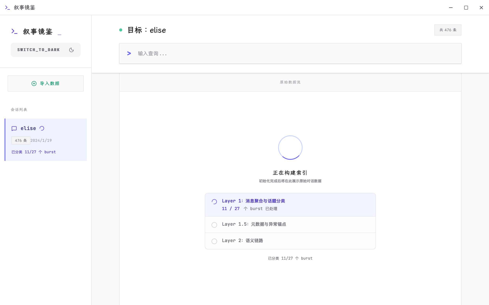
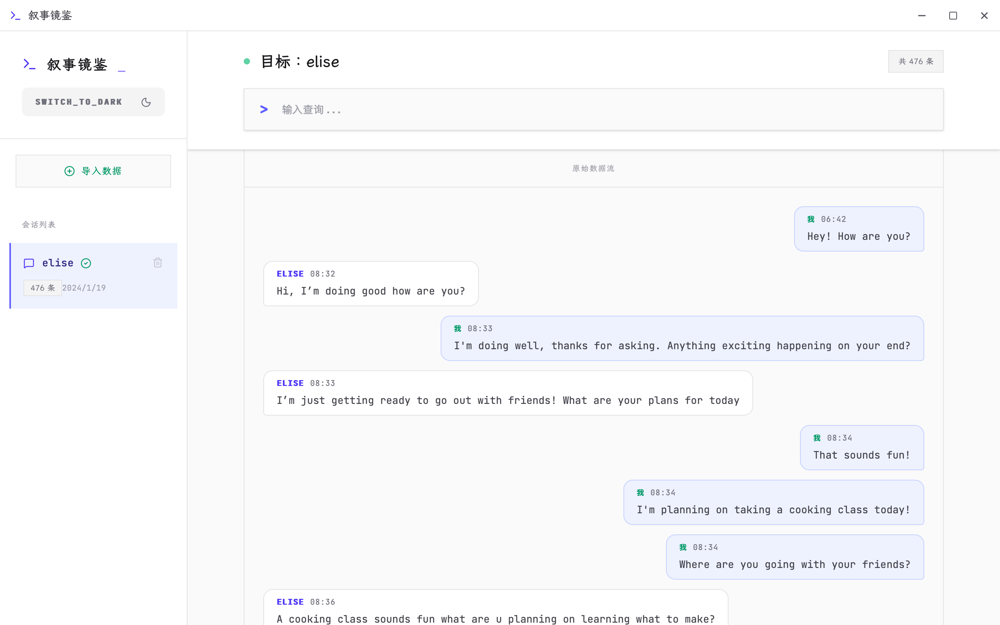
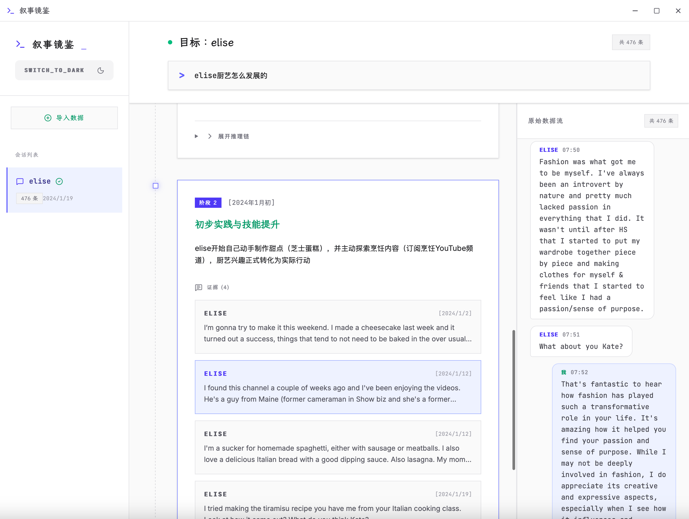
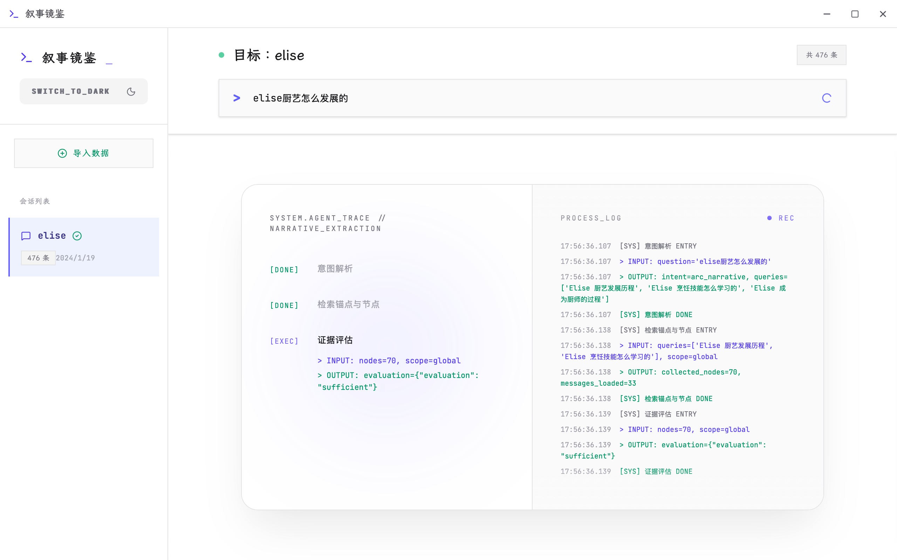
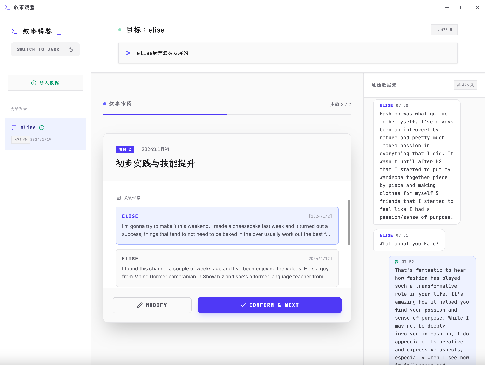
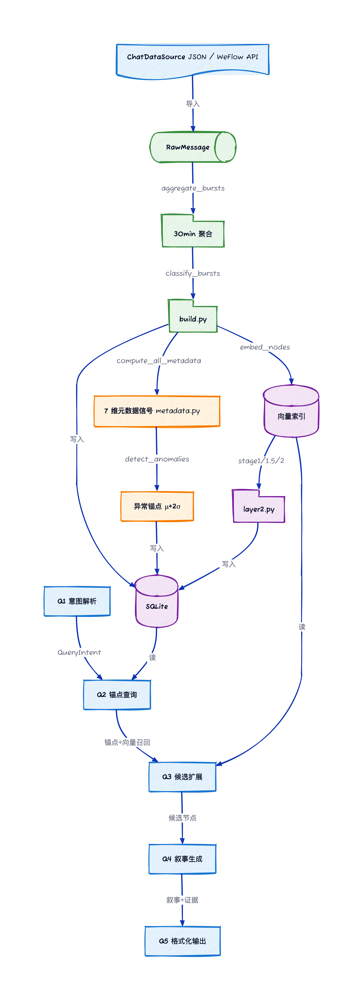

<div align="center">
  
</div>

# narrarc

[](https://opensource.org/licenses/MIT)
[](https://www.python.org/downloads/)
[](https://tauri.app/)

## 项目意义

灵感来自 [Page Index](https://pageindex.ai) 这类非传统 RAG 项目：不做固定 chunk 切分，而是把内容按结构喂给大模型——像人类看书一样，先看目录再进章节。传统 RAG 用固定 token 切块、向量召回、Re-rank 的「一力降十会」方式，对聊天记录这种半结构化文本并不友好。

**为什么只做聊天记录？** 小说、日志、邮件各有特性，通用方案效果不佳。聊天记录有天然时间戳和对话边界，适合做「按时间 → 按话题」的层级拆分。

**narrarc 做两件事：**

1. **初始化**：按时间切成 Burst，再在 Burst 内按话题聚类，形成 TopicNode 和语义线程。
2. **查询**：传统 RAG 只能回答「去年 7 月说了什么」这类碎片问题。人际交往里更有价值的是连续性问题——「我们是怎么一步步走到一起的？」「怎么一步步分手的？」——需要串联整段信息流。narrarc 能捕捉这种变化，并**用原始聊天记录作为佐证**。

将微信聊天历史转化为有证据支持的叙事弧。双层索引架构，支持自然语言查询关系动态变化。

## 截图与核心功能

### 1. 系统主入口 (Welcome Screen)

叙事镜鉴的主界面，提供清晰的导航，方便用户一键进入“启动引擎”（叙事查询）或“数据接入”（构建索引）。

### 2. 自然语言叙事查询 (Narrative Mirror Room)

核心的问答探索区。用户可通过自然语言提问（例如：“我们是怎么认识的？”），系统不仅会生成连贯的故事弧，还会精准附上相关的原始聊天记录作为“证据”支撑。

### 3. 证据溯源与上下文详情 (Evidence Tracking)

当用户点击叙事中的引用标记时，系统会展示具体的聊天上下文与元数据，确保每一段叙事分析都有迹可循。

### 4. 话题聚类与语义提取 (Topic & Semantic View)

展示底层的数据处理结果，包括按时间切分的 Burst 聚合状态、话题节点（TopicNode）抽取情况以及多维情感信号的可视化。

### 5. 数据处理与设置中心 (Data Center & Settings)

用于管理本地数据库状态、配置 LLM 参数以及触发双层索引（生成 TopicNode 和语义线程）的构建流。

## 项目结构

```
narrarc/
├── backend/      # Python 后端（narrative_mirror）
├── client/       # Tauri 桌面客户端（叙事镜鉴）
└── README.md
```

## 快速开始

### 后端

```bash
cd backend
uv sync
uv run python -m narrative_mirror.build --talker mock_talker_001 --debug
uv run python -m narrative_mirror.metadata --talker mock_talker_001 --debug
uv run python -m narrative_mirror.layer2 --talker mock_talker_001 --debug
uv run python -m narrative_mirror.query --talker mock_talker_001 "我们是怎么一步步分手的？"
```

### 客户端

```bash
cd client
npm install
npm run tauri:dev
```

**前置要求**：
- **uv**（Python 包管理）在 PATH 中。若未安装：`powershell -ExecutionPolicy ByPass -c "irm https://astral.sh/uv/install.ps1 | iex"`，安装后把 `%USERPROFILE%\.local\bin` 加入 PATH。
- **Node.js 18+**（客户端构建与 Tauri 需要）。
- **Rust**（Tauri 2 首次构建时会提示安装）。

**一键本地运行**（自动安装 uv、Node.js、Rust、MSVC Build Tools，然后启动桌面客户端）：
```cmd
run-local.cmd
```
或（若遇「禁止运行脚本」则用）：
```powershell
powershell -NoProfile -ExecutionPolicy Bypass -File .\run-local.ps1
```
- 首次运行若缺少 **Visual Studio Build Tools**，会自动通过 winget 安装（体积较大，约 10–20 分钟），完成后请再执行一次上述命令即可打开 Tauri 窗口。
- Node.js 若未安装会下载便携版到项目目录 `.node/`，无需全局安装。

## 导入示例数据

客户端内置示例：`client/data/samples/realtalk_emi_elise.json`。在「导入数据」中选择该文件即可快速体验。

## 配置

- 后端 LLM：`backend/config.yml`（参考 `backend/config.yml.example`）
- 数据库：`backend/data/mirror.db`（自动创建）

## 架构与数据流

